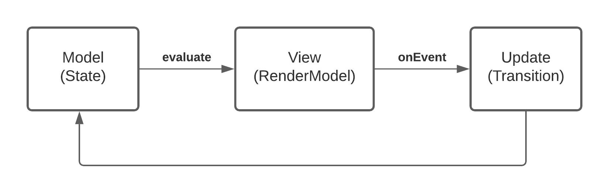

A Kotlin framework for managing state and side effects. It is inspired by MVU(model, view, update)
architecture and best of functional, declarative and reactive patterns. It enables building
deterministic, composable, testable applications.



### Quick example
To demonstrate some of the concepts we will make a simple counter application. It shows the current count and
has two buttons to increment and decrement it.

One of the best practises when working with Formula is to first think what the UI needs for rendering and what
actions the user will be able to take. This concept is called an `Output` and is represented by a Kotlin data class.

#### Output
Output is an immutable representation of your view. It will be used to update the UI. Typically,
it will also contain event listeners that will be invoked when user interacts with the UI.
```kotlin
data class CounterOutput(
  val count: String,
  val onDecrement: () -> Unit,
  val onIncrement: () -> Unit,
)
```

Once we define an Output, we can create a Composable function that renders it.

#### Compose UI
```kotlin
@Composable
fun CounterScreen(output: CounterOutput) {
  Column(
    modifier = Modifier.fillMaxSize(),
    verticalArrangement = Arrangement.Center,
    horizontalAlignment = Alignment.CenterHorizontally,
  ) {
    Text(text = output.count)
    Row {
      Button(onClick = { output.onDecrement() }) {
        Text("Decrement")
      }
      Spacer(Modifier.size(8.dp))
      Button(onClick = { output.onIncrement() }) {
        Text("Increment")
      }
    }
  }
}
```

We now defined a single entry-point to our rendering (this makes debugging issues a lot easier). Anytime
you need to update UI, just call the composable with a new Output.

Now that we have our rendering logic setup, let's define how we create the Output and handle user events. To have
a dynamic UI that changes as user interacts with it requires some sort of state.

#### State
State is a Kotlin data class that contains all the necessary information/data to render your view. In our counter
example, we need to keep track of the current count.
```kotlin
data class CounterState(val count: Int)
```

Given that this is a simple state, you could also use `Int` directly.

#### Formula
Formula is responsible for creating the Output. It can define an internal `State` class and respond to
various events by transitioning to a new state.

```kotlin
class CounterFormula : Formula<Unit, CounterState, CounterOutput>() {

  override fun initialState(input: Unit): CounterState = CounterState(count = 0)

  override fun Snapshot<Unit, CounterState>.evaluate(): Evaluation<CounterOutput> {
    val count = state.count
    return Evaluation(
      output = CounterOutput(
        count = "Count: $count",
        onDecrement = context.onEvent {
          transition(state.copy(count = count - 1))
        },
        onIncrement = context.onEvent {
          transition(state.copy(count = count + 1))
        }
      )
    )
  }
}
```

The most important part is the `Formula.evaluate` function. It gives us the current `State` and expects an
`Evaluation<Output>` back. Any time we transition to a new state, evaluate is called again and new Output
is created.

There is also a special object called `FormulaContext` being passed. Formula Context allows us to respond to events by
declaring transitions. We use `context.onEvent` for both `onIncrement` and `onDecrement`. Let's look at one of these
functions closer.

```kotlin
onDecrement = context.onEvent {
  transition(state.copy(count = count - 1))
}
```

In response to the decrement event, we take the current `count` and subtract `1` from it. Then, we call `transition`
to create a new state and return it as a `Transition.Result`.

If you notice, our logic currently allows user to decrement to a number below 0. We can update the transition logic to
prevent this.
```kotlin
onDecrement = context.onEvent {
  if (count == 0) {
    none()
  } else {
    transition(state.copy(count = count - 1))
  }
}
```

The listener block uses a DSL provided by `TransitionContext` which has the `transition` and `none`
utility functions (take a look at that class for other utility functions).

Now that we defined our state management, let's connect it to our Compose UI.

#### Using Formula
Formula is agnostic to other layers of abstraction. It can be used within activity or a fragment. You can
convert `Formula` to a Kotlin `StateFlow` by using `runAsStateFlow` function.
```kotlin
val formula = CounterFormula()
val scope = CoroutineScope(Dispatchers.Main)
val outputs: StateFlow<CounterOutput> = formula.runAsStateFlow(scope, input = Unit)
```

Ideally, it would be placed within a surface that survives configuration changes such as [Android Components ViewModel](android-view-model.md). You can
see the full <a href="https://github.com/instacart/formula/tree/master/samples/counter" target="_blank">sample here</a>.

### Download
Add the library to your list of dependencies:

```groovy
dependencies {
    implementation 'com.instacart.formula:formula:0.7.1'
    implementation 'com.instacart.formula:formula-android:0.7.1'

    // Optional: Compose integration
    implementation 'com.instacart.formula:formula-android-compose:0.7.1'

    // Optional: RxJava3 support
    implementation 'com.instacart.formula:formula-rxjava3:0.7.1'
}
```

**Note:** Formula core uses Kotlin Coroutines. The `formula-rxjava3` module is optional and only needed if you want RxJava3 integration.

### Inspiration
Formula would not have been possible without ideas from other projects such as

- Elm
- Cycle.js
- React / Redux
- Mobius
- Square Workflows

### License

```
The Clear BSD License

Copyright (c) 2022 Maplebear Inc. dba Instacart
All rights reserved.

Redistribution and use in source and binary forms, with or without modification, are permitted
(subject to the limitations in the disclaimer below) provided that the following conditions are met:

* Redistributions of source code must retain the above copyright notice, this list of conditions and the following disclaimer.
* Redistributions in binary form must reproduce the above copyright notice, this list of conditions and the following disclaimer in the documentation and/or other materials provided with the distribution.
* Neither the name of Maplebear Inc. dba Instacart nor the names of its contributors may be used to endorse or promote products derived from this software without specific prior written permission.

NO EXPRESS OR IMPLIED LICENSES TO ANY PARTY'S PATENT RIGHTS ARE GRANTED BY THIS LICENSE. THIS SOFTWARE IS PROVIDED BY
THE COPYRIGHT HOLDERS AND CONTRIBUTORS "AS IS" AND ANY EXPRESS OR IMPLIED WARRANTIES, INCLUDING, BUT NOT LIMITED TO,
THE IMPLIED WARRANTIES OF MERCHANTABILITY AND FITNESS FOR A PARTICULAR PURPOSE ARE DISCLAIMED. IN NO EVENT SHALL THE
COPYRIGHT HOLDER OR CONTRIBUTORS BE LIABLE FOR ANY DIRECT, INDIRECT, INCIDENTAL, SPECIAL, EXEMPLARY, OR CONSEQUENTIAL
DAMAGES (INCLUDING, BUT NOT LIMITED TO, PROCUREMENT OF SUBSTITUTE GOODS OR SERVICES; LOSS OF USE, DATA, OR PROFITS;
OR BUSINESS INTERRUPTION) HOWEVER CAUSED AND ON ANY THEORY OF LIABILITY, WHETHER IN CONTRACT, STRICT LIABILITY, OR
TORT (INCLUDING NEGLIGENCE OR OTHERWISE) ARISING IN ANY WAY OUT OF THE USE OF THIS SOFTWARE, EVEN IF ADVISED
OF THE POSSIBILITY OF SUCH DAMAGE.
```
